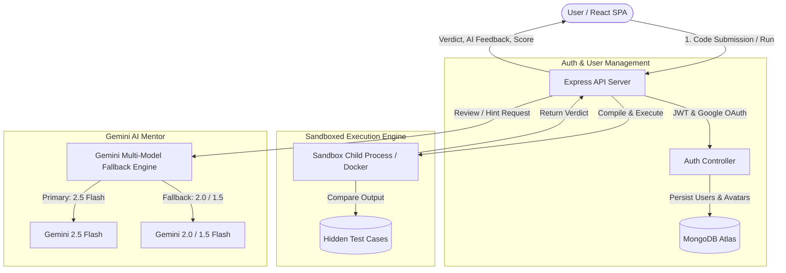

# JudgeX – Next-Gen Online Coding & Competitive Programming Platform

<div align="center">
  
  <h3>Sandboxed Code Execution, AI Mentor Reviews, and Global Competitive Leaderboard</h3>

  [](https://reactjs.org/)
  [](https://nodejs.org/)
  [](https://expressjs.com/)
  [](https://www.mongodb.com/)
  [](https://ai.google.dev/)
  [](https://www.docker.com/)
  [](https://judgex.vercel.app/)
</div>

---

## 📌 Overview

**JudgeX** is a full-stack algorithmic coding platform engineered for technical interview preparation, competitive programming, and automated code evaluation. It features sandboxed multi-language compilation (**C++**, **Python 3**, **Java**), automated test case verification, Google Gemini AI code mentoring, progressive 3-tier hints, customizable user avatars, and real-time global rankings.

---

## 🏗️ Architecture Workflow



---

## 🚀 Key Features

### ⚡ Sandboxed Code Execution
* **Multi-Language Support**: Native compiler and runtime execution for **C++ (GCC)**, **Python 3**, and **Java (OpenJDK)**.
* **Isolated Environment**: Untrusted user code is executed in isolated processes with strict memory and time limits (2.0s limit, 256MB RAM).
* **Test Case Verification**: Automatically runs submitted solutions against predefined sample inputs and hidden judge test cases to determine verdicts (`Accepted`, `Wrong Answer`, `Time Limit Exceeded`, `Runtime Error`).

### 🤖 Gemini AI Mentor & 3-Tier Progressive Hints
* **Multi-Model Fallback Engine**: Automatic priority failover (`gemini-2.5-flash` $\rightarrow$ `gemini-2.0-flash` $\rightarrow$ `gemini-1.5-flash`) ensuring 99.9% AI review uptime without downtime during peak loads.
* **Deep Code Review**: Evaluates time/space algorithmic complexity ($O(N)$, $O(\log N)$), analyzes missed edge cases, and suggests clean idiomatic refactors without spoiling the solution directly.
* **3-Tier Progressive Hints**:
  * **Hint 1 (Intuition)**: Core pattern recognition and conceptual thinking.
  * **Hint 2 (Approach)**: Data structure choice and algorithm roadmap.
  * **Hint 3 (Pseudocode)**: Structured step-by-step implementation guide.
* **Rate Limiting & Cooldowns**: Built-in backend rate limiters (`express-rate-limit`) and frontend countdown timers (10s for AI review, 5s for hints) preventing quota exhaustion.

### 📊 Problem Repository & Progress Tracking
* **Dynamic Filter Chips & Search**: Filter problems by difficulty (**Easy**, **Medium**, **Hard**) or personal completion status (**✓ Solved**, **⚡ Attempted**, **○ Todo**).
* **Live Progress Bar**: Displays real-time personal completion metrics ($X / Y \text{ Solved}$).

### 🏆 Global Leaderboard & Hall of Fame
* **Top 3 Podium**: Visual Gold, Silver, and Bronze podium cards showcasing top algorithmic problem solvers.
* **Rankings Table**: Real-time rank calculation based on verified problem submissions with active user highlights (`You` badge).

### 👤 Profile & Authentication
* **Dual Auth Support**: Traditional JWT-based email/password authentication alongside **Google One-Tap OAuth**.
* **Avatar Customization**: Choose from 8 preset developer avatars (DiceBear Bottts, Adventurer, Pixel-Art) or link a custom image URL.

### 📜 Submission Timeline
* **Detailed History**: Review historical submission records with exact date/time timestamps, execution runtime, and verdict status.
* **Syntax Highlighted Code Viewer**: Expandable Monaco-styled code viewer with 1-click clipboard copying.

---

## 🛠️ Tech Stack

| Layer | Technology |
|---|---|
| **Frontend** | React 19, Vite, React Router v7, Monaco Editor, React Markdown, FontAwesome |
| **Backend** | Node.js, Express.js, `express-rate-limit`, Child Process, Docker |
| **Database** | MongoDB Atlas, Mongoose |
| **AI Integration** | Google Gemini Generative AI SDK (`@google/genai`) |
| **Authentication** | JWT (`jsonwebtoken`), `bcryptjs`, `@react-oauth/google` |

---

## 📡 API Reference

### 🔐 Authentication (`/api/auth`)
| Method | Endpoint | Description | Auth |
|---|---|---|---|
| `POST` | `/api/auth/register` | Register a new user | Public |
| `POST` | `/api/auth/login` | Sign in with email & password | Public |
| `POST` | `/api/auth/google` | Authenticate with Google OAuth credential | Public |
| `PUT` | `/api/auth/avatar` | Update user profile avatar | Bearer Token |

### 📚 Problems (`/api/problems`)
| Method | Endpoint | Description | Auth |
|---|---|---|---|
| `GET` | `/api/problems` | List problems with dynamic user solved/attempted status | Public / Optional Token |
| `GET` | `/api/problems/:id` | Fetch problem details, format, constraints & examples | Public |
| `POST` | `/api/problems` | Create new coding problem with test cases | Admin Only |
| `PUT` | `/api/problems/:id` | Update existing problem | Admin Only |
| `DELETE` | `/api/problems/:id` | Delete problem | Admin Only |

### 💻 Execution & Submissions
| Method | Endpoint | Description | Auth |
|---|---|---|---|
| `POST` | `/api/run` | Execute code with custom input | Public |
| `POST` | `/api/submissions` | Submit code for evaluation against test cases | Bearer Token |
| `GET` | `/api/submissions` | Retrieve user submission history with timestamps | Bearer Token |

### 🤖 Gemini AI Mentoring (`/api/gemini-review`)
| Method | Endpoint | Description | Limits |
|---|---|---|---|
| `POST` | `/api/gemini-review` | Request AI code review & complexity analysis | 10 req / 15 min |
| `POST` | `/api/gemini-review/hint` | Request progressive Hint (Level 1, 2, or 3) | 15 req / 15 min |

### 🏆 Leaderboard (`/api/leaderboard`)
| Method | Endpoint | Description | Auth |
|---|---|---|---|
| `GET` | `/api/leaderboard` | Get ranked leaderboard based on verified solved problems | Public |

---

## ⚡ Local Setup & Installation

### Prerequisites
* **Node.js**: v18.0 or higher
* **MongoDB**: Local instance or MongoDB Atlas connection URI
* **Google Gemini API Key**: Obtain from [Google AI Studio](https://aistudio.google.com/)
* **Google OAuth Client ID**: (Optional) For Google One-Tap Sign In

---

### 1. Clone the Repository
```bash
git clone https://github.com/abhi0324/Online-Judge.git
cd Online-Judge
```

---

### 2. Backend Setup
```bash
cd backend
npm install
```

Create a `.env` file in the `backend/` directory:
```env
PORT=8000
MONGO_URI=mongodb+srv://<username>:<password>@cluster.mongodb.net/judgex?retryWrites=true&w=majority
JWT_SECRET=your_jwt_secret_key_here
GEMINI_API_KEY=your_gemini_api_key_here
GOOGLE_CLIENT_ID=your_google_client_id_here
```

Start the backend server:
```bash
npm run dev
# Server running on http://localhost:8000
```

---

### 3. Frontend Setup
```bash
cd ../frontend
npm install
```

Create a `.env` file in the `frontend/` directory:
```env
VITE_API_URL=http://localhost:8000/api
VITE_GOOGLE_CLIENT_ID=your_google_client_id_here
```

Start the frontend development server:
```bash
npm run dev
# App running on http://localhost:5173
```

---

## 🐳 Docker Deployment (Optional)

You can run the backend in a containerized environment:

```bash
cd backend
docker build -t judgex-backend .
docker run --env-file .env -p 8000:8000 judgex-backend
```

---

## 📄 License

This project is licensed under the **ISC License**.

---

## 👤 Author

**Abhiswant Chaudhary**
* GitHub: [@abhi0324](https://github.com/abhi0324)
* LinkedIn: [Abhiswant Chaudhary](https://www.linkedin.com/in/abhiswant-chaudhary-a09253277)
* X (Twitter): [@abhiswant](https://x.com/abhiswant)